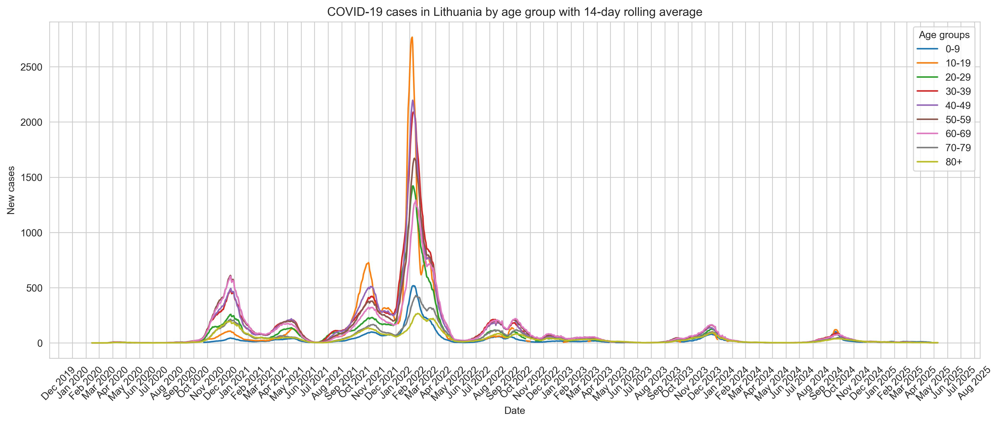
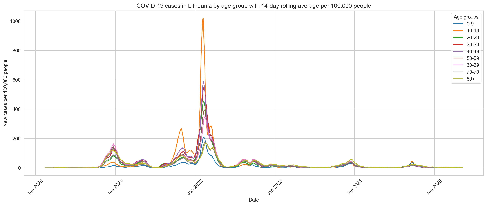
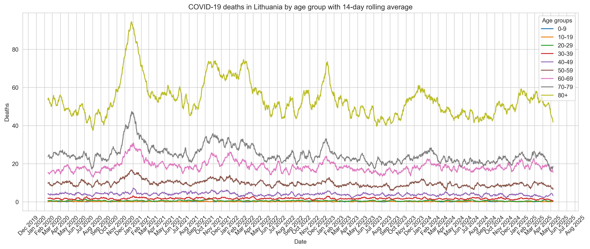
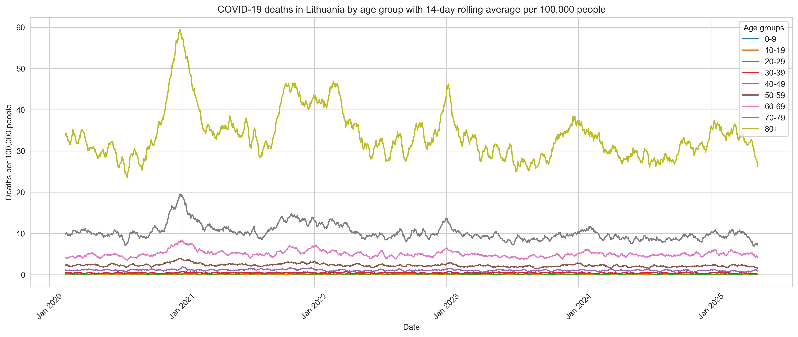
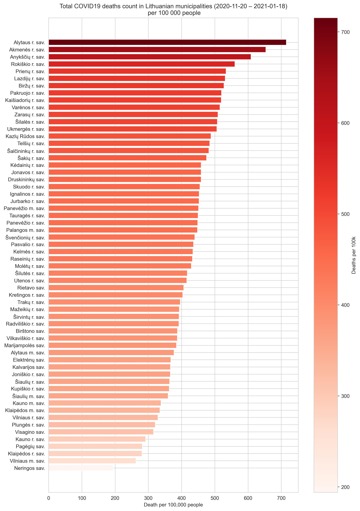

### Analysis of COVID19 cases and deaths in Lithuania since 2020

1. Cleaned and transformed public datasets(COVID and population).
  
  
2. Implemented 14-days moving average smoothing for time series analysis

3. Developed charts to show infection and death trends over time by age category.
  

4. Normalizes these charts by 100.000 population in each age group.

5. ## 60-days period with highest total 10615 COVID19 deaths in Lithuania occured between 2020-11-20 and 2021-01-18

 
6. For this 60-days period normalized deaths count by 100.000 population for LT municipalities and build a chart with gradient.
   

## 📊 Dashboard Overview

### New covid19 cases in Lithuania by age groups with 14-days average

### New covid19 cases in Lithuania by age groups with 14-days average per 100000 population

### Covid19 deaths in Lithuania by age groups with 14-days average

### Covid19 deaths in Lithuania by age groups with 14-days average per 100000 population

### Municipalities ranking by total deaths at the 60days period where total deaths were highest in Lithuania
