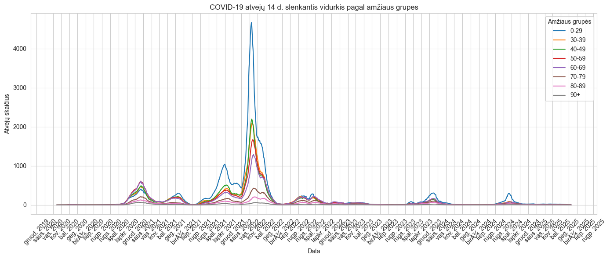
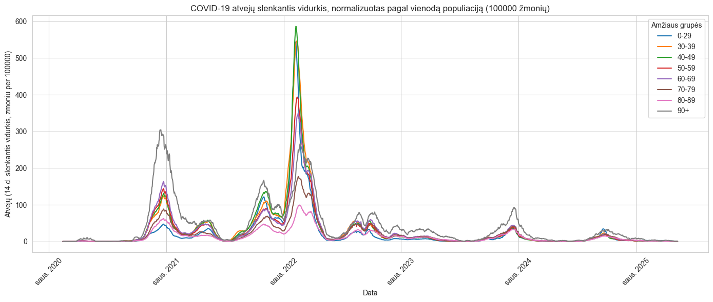
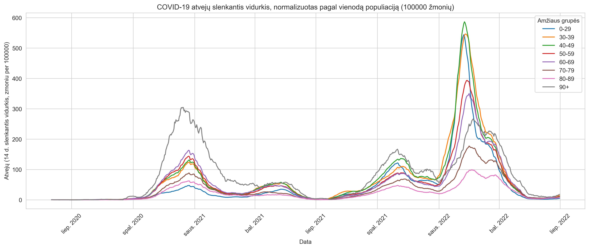

Analysis of COVID19 cases and deaths in Lithuania since 2020

1. Cleaned and transformed public datasets(COVID and population).
  
  
2. Implemented 14-day moving average smoothing for time series analysis

3. Developed a plot to show infection trends over time by age category.
  

4. Normalizes this plot by 100.000 population in each age group.

5. Found 60days period per which COVID19 total deaths were highest.

 
6. In this 60days period found top10 municipalities where total deaths in that period were highest. Made a plot.
   

## 📊 Dashboard Overview

### New covid19 cases in Lithuania in different age groups

### New covid19 cases in Lithuania in different age groups per 100000 people

### New covid19 cases in Lithuania in different age groups per 100000 people, June 2021-June2022

